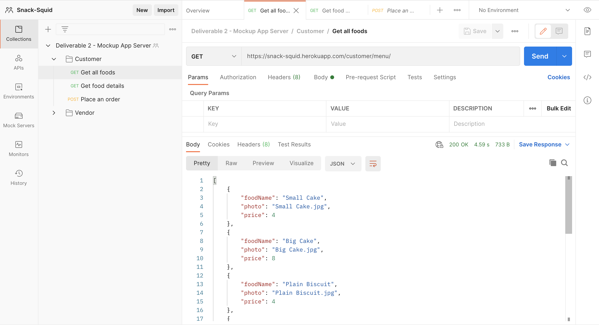
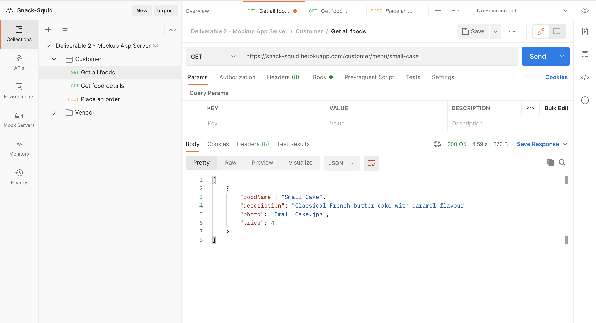
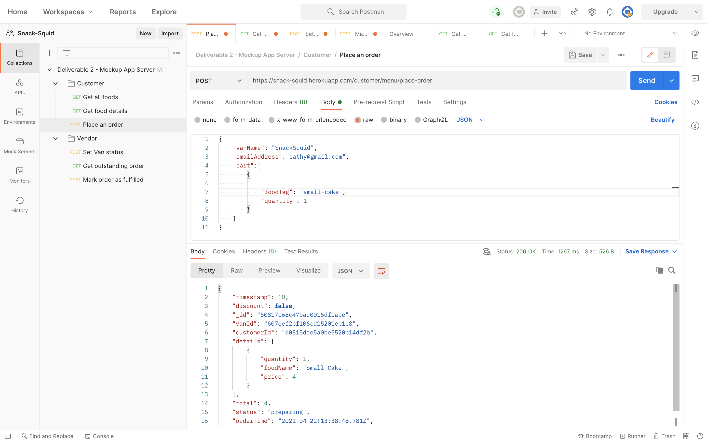
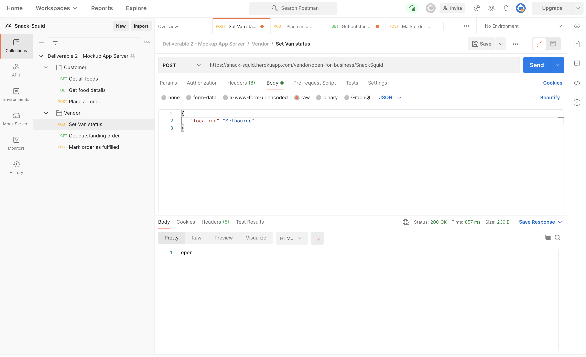
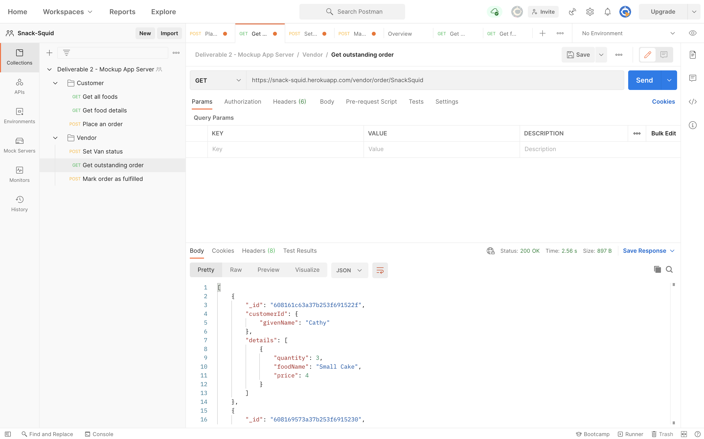
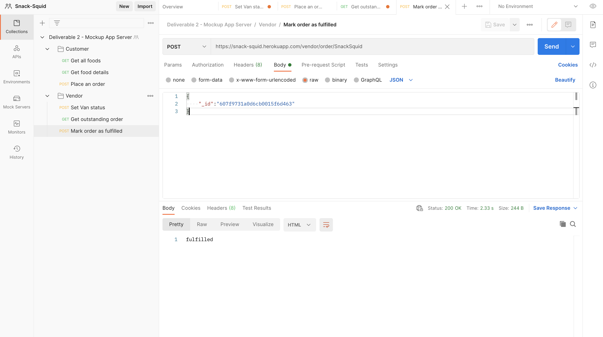

## **The University of Melbourne - INFO30005 (Web Information Technologies) Project**

### Note: This is just the copy of the original project repository.

## Table of contents
* [Introduction](#introduction)
* [Team Members](#team-members)
* [Technologies](#technologies)
* [Deliverable 2 Instruction](#deliverable-2-instruction)
* [Deliverable 3 Instruction](#deliverable-3-instruction)

## Introduction
* Customer web app: https://snack-squid.herokuapp.com/customer/
* Vendor web app  : https://snack-squid.herokuapp.com/vendor/

## Team Members

| Name         |   Status |
| :---         |   -----  |
| Tom Zhi Hern |   Done   |
| Qian Ziyu    |   Done   |
| Yu Kaixin    |   Done   |
| Yi Qiteng    |   Done   |
| Chen Yi      |   Done   |


## Technologies
Project is created with:
* NodeJs : 14.16.X
* Express : 4.17.1
* Mongoose : 5.12.3

### Local installation
```
git clone git@github.com:tzhern/INFO30005-Project.git
cd INFO30005-Project/snack-squid
npm install
npm start
```

### Testing 
npm test -- open_controller_unit.js   unit testing van's open status
npm test -- profile_controller_unit.js   unit testing van's close status
npm test -- one_van_status_integration.js   integration test van's status

### Dummy Customer account
1. email address: cathy@gmail.com   password: 1234qwer
2. email address: ziyuq@gmail.com   password: 1234qwer
3. email address: tom@gmail.com     password: 1234qwer
4. email address: hehe@gmail.com    password: 1234qwer
5. email address: chenyi@gmail.com  password: 1234qwer

### Dummy Van account
1. van name: SnackSquid    password: 1234qwer
2. van name: Pinacolada    password: 1234qwer
3. van name: Okie          password: 1234qwer
4. van name: JuicyBaby     password: 1234qwer
5. van name: TomVanGood    password: 1234qwer

## Deliverable 2 Instruction
### Notes: 
1. Use *Postman* to test our routes.
2. If the route is working, a json formatted output will be sent to you.

### Customer
1. To see the menu, go to [https://snack-squid.herokuapp.com/customer/menu] with GET method.
   
2. To see the details of one specific food. go to [https://snack-squid.herokuapp.com/customer/menu/:tag] with GET method. 
    
    Replace **quantity** and **foodTag** with one of the following:
    |      Food     |      :tag     |
    | :---          |          ---: |
    | Small Cake    | small-cake    |
    | Big Cake      | big-cake      |
    | Plain Biscuit | plain-biscuit |
    | Fancy Biscuit | fancy-biscuit |
    | Latte         | latte         |
    | Long Black    | long-black    |
    | Cappuccino    | cappuccino    |
    | Flat White    | flat-white    |
3. To place an order, go to [https://snack-squid.herokuapp.com/customer/menu] with POST method and insert yout order in this format
    
    An order detail will be sent to you in json format once the order has been sent successfully. Please note that you are only required to insert foodTag and quantity as you are assummed logged in and a van is assummed selected.

### Vendor
1. To set the van status, using the route [https://snack-squid.herokuapp.com/vendor/open-for-business/:[samplevan]] using POST method. If you have "location" in you req.body, it will update the location and change open status as true. If you have no location, it will send a message "You have to enter location"

    
2. To show the list of all outstanding orders,go to [https://snack-squid.herokuapp.com/vendor/order] and it will show the orders of all vans. If want to get orders for specific van, using [https://snack-squid.herokuapp.com/vendor/order/:vanName]

    
3. To mark an order as "fulfilled", go to [https://snack-squid.herokuapp.com/vendor/order/:vanName] and use "_id" in req.body to look up specific order of the van and mark it as fulfilled. The status of order in mongodb will be "fulfilled"

        


## Deliverable 3 Instruction
### Login Section
1. dummy customer account: 
    - Email Address: kcathy@gmail.com
    - Password: 123123

### Van detail
We only have one van open, which is SnackSquid.

### URL details
https://snack-squid.herokuapp.com/customer/ The homepage of customer app, you can login and signup, press "Find a nearby van" can redirect to menu page
    
https://snack-squid.herokuapp.com/customer/menu/van=SnackSquid We assume customers have choosen van "SnackSquid", press “+” and "-" button will add the product into cart.
    
If press the image, you will be redirected to detail page and you can also modify cart on this page.
    
View cart will show the details of current order, and checkout will place the order in the main menu page.
    
If the user has not logged in, you cannot checkout and will be rendered to login
    
After placing order, the page will redirect to order page.
    
To logout, use https://snack-squid.herokuapp.com/customer/profile and click logout button

